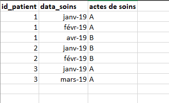

# CATclustering : Care trajectories analysis by clustering, partitioning and sequential analysis

CATclutering is a package that allows you to perform an analysis of the care path or trajectory using an unsupervised classification method followed by a sequential analysis.

There are several packages that implement unsupervised claassification but this CATclustering takes into account K-mean and CAH. For the sequential analysis the solution provided by TraMineR which is the most complete and powerful solution to date is taken into account.

The CATclustering package also takes into account longitudinal data and data by describing acts of care by row.

**longitudinal data**

**acts of care by row**

